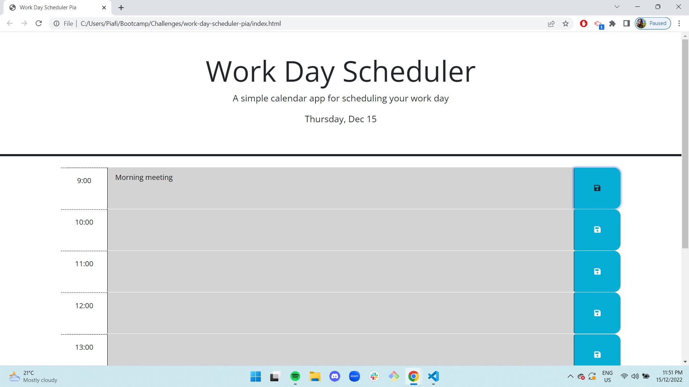

# Work day scheduler 

## User Story
```md
As a full stack bootcamp student with a busy schedule
I WANT to add important events to a daily planner
SO THAT I can manage my time effectively
```

## Usage
```md
This workday scheduler display office hours from 9AM until 5PM. On the top of the page current date it is display. 
The scheduler show working hours in blocks colored coded: grey for past, red for present and green for furute. Each block has an iput to write down information/task and a save button in the shape of a floppy disk. Once the floppy disk is clicked, the information is saved in local storage and it will be display after refreshing the page, if user wants to elimate the information /tast it has to delite it manually from the input space and press save button.
```

### Link to deploy website
[https://pia-fierro.github.io/work-day-scheduler-pia/](https://pia-fierro.github.io/work-day-scheduler-pia/)


### Screenshot of website


